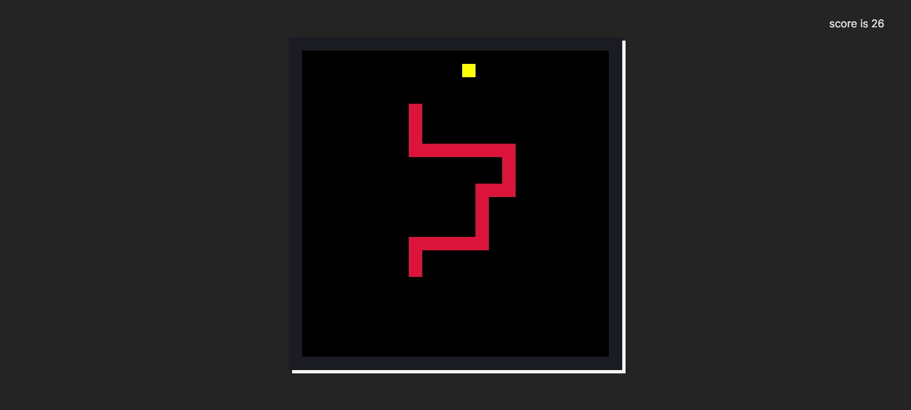

Snake game written in typescript

# customization

to customize difrent elements of the game open localstorage in the debug pannel and edit the fields

| field | type | usage |
| ----- | ---- | ----- |
| FPS   | number | frame rate of the game (not exactly but close) |
| WALLS | boolean | walls will be placed at the border of the map and coliding with them ends the game |
| GRID_DIMENSION | number | the size of the map in pixels |
| GRID_SIZE | number | number of cells and rows |
| SNAKE_COLOR | string | the color of the snake in any format supported by css |